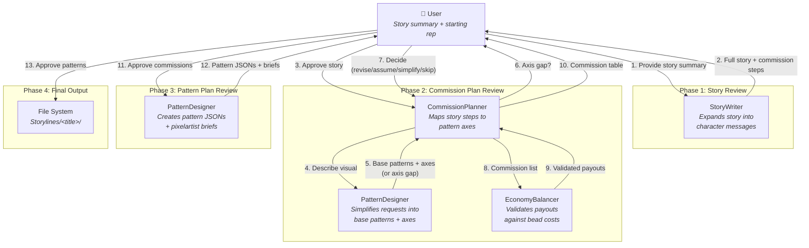
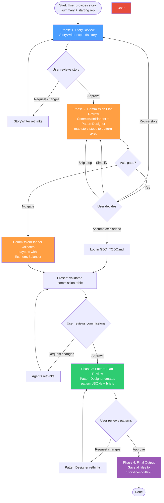

# Architecture

## Agent Connections

## Phase Flow with Human-in-the-Loop

## Agent Responsibilities

| Agent | Role | Phase(s) |
|-------|------|----------|
| **StoryWriter** | Expands story summaries into character messages with complexity hints | Phase 1 |
| **CommissionPlanner** | Maps story steps to pattern axes, assembles commission objects, validates payouts | Phase 2 |
| **PatternDesigner** | Simplifies requests into base patterns, checks axes, creates pattern JSONs and briefs | Phase 2, Phase 3 |
| **EconomyBalancer** | Validates payouts against bead costs and progression stage | Phase 2 |

## Cross-Agent Communication

| From | To | What |
|------|----|------|
| StoryWriter | CommissionPlanner | Story messages, narrative context, complexity hints |
| CommissionPlanner | PatternDesigner | Natural-language descriptions of what each pattern should show |
| PatternDesigner | CommissionPlanner | Base patterns with axes (or axis gap reports) |
| CommissionPlanner | EconomyBalancer | Full commission list for payout validation |
| EconomyBalancer | CommissionPlanner | Validated/adjusted payouts |
| PatternDesigner | Human Pixelartist | Pattern briefs (markdown) |
